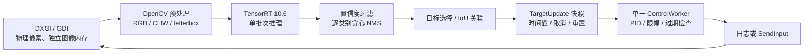

# 本机部署与问题修复报告

完成日期：2026-09-12。本报告区分“代码已实现”“本机已验证”和“仍需目标场景验证”，避免把可运行误认为模型与闭环效果已经全面达标。

后续更新：`start.cmd` 已改为中文数字菜单，支持类别预览/控制、图片视频、测速、标定、设置和维护。预览新增目标未选中原因、输出条件及分段耗时，并修复暂停/空采样时残留红圈。核心回归增加预览状态组。以下初次部署数据保留作为历史记录；新版使用方法见 [README](D:/Projects/Test_Study_Yolo/README.md)，本次约 46 FPS 的预览和 GPU 独立测速见 [性能说明](D:/Projects/Test_Study_Yolo/docs/performance-explained.md)。

## 本机结果

- 已安装 Visual Studio Build Tools 2022，使用 MSVC 19.38 / Windows SDK 19041；CUDA 12.6.3、TensorRT 10.6.0.post2、OpenCV 4.10.0 位于项目 .local 目录。
- 已生成 Release 程序 dist/TestStudyYolo.exe，以及本机 RTX 3060 Ti 的 FP16 引擎。
- 官方 ONNX checker 的完整检查通过；六张仓库样例的 ONNX Runtime CPU 与 TensorRT FP16 对照全部通过。检测框数量一致，存在匹配框的样例最低 IoU 为 0.993995。
- 核心测试覆盖目标跟踪、PID、并发/退出与图像/NMS 四组行为；运行测试覆盖缺失模型、非法显示器、离线输入禁用、干运行、两种采集、运行期退出和构建期取消。
- 5 秒无窗口采样：DXGI 641 帧，128.08 FPS；GDI 440 帧，87.94 FPS，均无采集错误，退出码均为 0。这是本机小窗口和当前桌面的短时吞吐量，不是目标场景的准确率或长期性能保证。
- 已测量 Windows 鼠标响应并保存本机标定。16 个输入单位得到约 21 物理像素，X/Y 比例均约 0.761905，往返恢复原位。启用了 Windows 加速，所以这个比例只适用于局部响应估计。
- 实时窗口已启动验证，显示器为 2560×1440。可视预览使用 GDI；GUI 消息处理、绘制和系统调度会降低吞吐量，本机窗口预览约 21–30 FPS。关闭窗口测试在 65 ms 内以退出码 0 结束。

## 十二项问题逐项处理

| 编号 | 判断与改动 | 主要实现 | 验证 |
|---|---|---|---|
| 1 | 原 smooth() 无限忙循环确实存在；已删除。控制线程使用条件变量和最小控制周期，只消费新的测量。 | src/pid.cpp | 空闲停止、单次消费、取消后无后续派发测试 |
| 2 | 原共享数据跨线程无完整同步；现由互斥量保护整个 TargetUpdate 快照与版本号，PID 仅由输出线程持有。 | src/application/pid.h、src/pid.cpp | 并发生产者、轴数据一致性、取消与在途回调屏障测试 |
| 3 | 原条件可使右键绕过“存在目标”的检查；现在先要求有效目标，再检查按钮。派发前再次检查实时按键和停止状态。 | src/config.cpp | 干运行无注入，源码只存在一处 SendInput 调用 |
| 4 | 原跟踪没有真正拒绝低 IoU 匹配；现在有独立 minimum_iou，首选目标结合中心距离和置信度，后续使用达到阈值的最大 IoU。 | src/mouse.cpp | 相同数量但零重叠的目标不能接替；初始排序与失配测试 |
| 5 | 原 aims_last_num 与丢失计数更新不完整；现在每个有效检测帧统计符合类别/阈值的候选数，计数仅用于观测，不能作为身份。空候选立即停止输出，丢失计数有上限，成功关联归零。 | src/mouse.cpp | 数量 2→1→0、短暂丢失恢复、超时重新选择、类别切换测试 |
| 6 | 原 PID 无时间尺度及边界；现在积分使用秒、导数除以 dt，含积分限幅、条件抗饱和、输出限幅、死区、整数余量和异常时间/数值清理。 | src/pid.cpp、config/default.yml | 饱和、积分时长一致性、死区、NaN、非法 dt、余量累计测试 |
| 7 | 原多线程同时影响鼠标输出；现在只有 ControlWorker 的回调派发，移动值用有符号坐标，检查 SendInput 返回值。标定也使用同一个线程机制。 | src/config.cpp、src/pid.cpp | 真正的有界正负轴标定；默认日志-only 路径验证 |
| 8 | 原失败时返回未初始化 200×416 图；现在无新帧和采集不可用均返回空 Mat，并区分状态，空图不会进入推理。 | src/dxgi-cap.cpp、src/config.cpp | 实际 DXGI 无新帧时统计为空采样，没有伪造检测；GDI/DXGI 正常采样测试 |
| 9 | 原 DXGI 内存步长与映射生命周期处理不完整；现在使用 RowPitch，在映射有效期内转换为独立 BGR 图；Map/Unmap 与 Acquire/Release 成对，HRESULT 失败进入恢复。 | src/dxgi-cap.cpp | 本机正常 DXGI 采样；错误路径静态复核。未通过硬件故障注入逐一触发所有 HRESULT 分支 |
| 10 | 原线程没有可用停止协议；现在有停止标志、通知和 join，按键/暂停/类别切换/丢失会取消。窗口消息在无帧及暂停时仍处理，引擎构建支持进度回调取消。 | src/pid.cpp、src/config.cpp、src/runtime/trt_detector.cpp | 程序停止文件退出约 207 ms；构建过程中取消测试；独立窗口启动/停止测试 |
| 11 | 原几何、DPI 与鼠标单位混用；现在统一物理像素、枚举显示器、保留所选显示设备身份，位置/尺寸变化清理控制状态；增加可保存的鼠标标定与独立应用修正比例。 | src/main.cpp、src/dxgi-cap.cpp、src/config.cpp | 本机单显示器与 Windows 光标标定通过；多屏、旋转屏、混合 DPI 及目标应用灵敏度仍需相应环境验证 |
| 12 | 原 fire() 名称与“更新目标”的实际职责不符；已替换为 update_target() 返回显式目标状态，由主循环发布或取消。 | src/application/mouse.h、src/mouse.cpp | 无目标、类别切换和重新捕获等状态均通过回归测试 |

## 当前数据流

图中的反馈只在启用输入且测试应用响应时成立；默认干运行只写日志。控制器不会持续重放旧帧位移，更快的检测结果会替换尚未消费的待处理测量。

## 同时解决的构建与推理问题

1. 原工程混合多个 CUDA/TensorRT 路径、不同计算架构、旧 Linux 路径及 Python 构建。当前入口改为 CMake + Ninja + MSVC 14.38，显式链接官方 TensorRT 10.6 解析器。模型标准算子无需仓库的旧自定义 ONNX 解析器。
2. 原模型使用动态 batch，却以固定“最大批次”混入实时单帧逻辑。新入口只允许 batch 1 的优化 profile，并验证输入、输出名称、形状和数据类型。GPU 操作失败、解析失败、模型缺失、反序列化失败均不会进入正常输入输出循环。
3. 引擎缓存带模型内容与环境身份，写完临时文件后再替换；缓存无法解析时重新构建。取消构建不会覆盖已存在的可用引擎。
4. 新图像预处理支持非连续 ROI，要求非空 8UC3。输入转换为 RGB、CHW、0–1 范围，统一 letterbox 与逆坐标计算。当前预处理在 CPU / OpenCV 上执行，GPU 负责 TensorRT 推理，未声称保留原 CUDA 预处理吞吐量。
5. 使用逐类别贪心 NMS，并测试 A 抑制 B、B 与 C 重叠而 A 不抑制 C 的链式情形，避免原并行近似 NMS 的抑制差异。
6. 本机中文 MSVC 输出曾造成 Ninja 头文件依赖前缀乱码，导致增量构建混入旧布局并在退出时崩溃。已统一 UTF-8 输出、修复旧缓存前缀、完整重编译，并在构建脚本中检查实际头文件依赖。

## 部署和操作

双击 start.cmd 启动可视预览，使用 GDI 且不注入鼠标移动。退出可按 ESC 或执行 scripts/stop.ps1；停止脚本检查进程路径和启动时间，避免 PID 复用时误操作其他程序。再次启动脚本会检查已有的同一预览实例。

scripts/run.ps1 提供前台 CLI，参数详见 README 或 --help。显式传入 --enable-input 才允许输出，且仍需按住左键或右键、识别处于启用状态、目标有效且测量未过期。离线图片和视频拒绝真实输入注入。

DXGI 是按桌面更新供帧的接口。本机后台启动测试出现连续“无新帧”的情况；程序正确保持空采样并取消输出。为了使默认可视预览在静态桌面上也持续采样，启动器使用 GDI。没有将任何占位图用于推理。

参数和标定位于 config/default.yml 与本机 config/calibration.yml。二者中的比例会相乘；标定文件不进入 Git。日志、模型、引擎、可执行文件和下载依赖也不进入 Git。用于验证的汇总结果已单独保存，不包含桌面截图。

## 未被这些结果证明的事项

- 不能据此断言“主要瓶颈一定不是 YOLO 精度”。当前验证证明解析、执行与坐标还原的数值一致性，尚无目标场景的带标签数据集、召回率、误检率和端到端控制误差曲线。
- IoU 跟踪仍属于短期关联。快速位移、遮挡和外观相同目标交叉仍可能失配；没有加入 Kalman、光流或 ReID。阈值拒绝和立即停止输出是明确的当前行为。
- 没有在高权限应用、原始鼠标输入、锁定光标、不同 FOV、不同屏幕缩放或多显示器硬件组合中宣称完成闭环实测。
- Windows 开启加速时，一次 16 单位的标定无法描述所有速度下的响应。程序检测设置变化并忽略不再匹配的标定，但不会替用户改动 Windows 鼠标设置。
- 历史教学框架不在默认构建中，其 commits({})、失败预处理入队、旧显式批次 API、跨流资源复用等问题仍应在独立移植这些示例时处理。本次活动主程序通过新的同步推理入口避开这些历史路径，没有把整个约千文件仓库宣称为全部修复和验证。
- 未做数小时稳定性、内存泄漏工具检查、所有设备故障注入或真实目标应用内的自动输入压力测试。本次真实输入验证限于可逆的桌面小位移标定。

可复核结果：docs/validation/environment.json、model-comparison.json、runtime-smoke.json、dxgi-headless.json、gdi-headless.json、preview.json、build.log。
